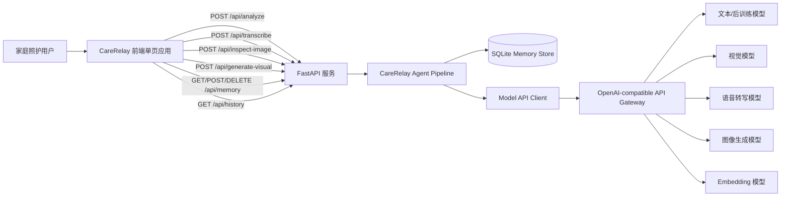
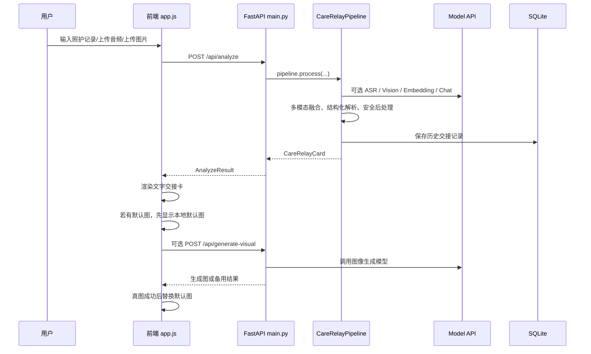
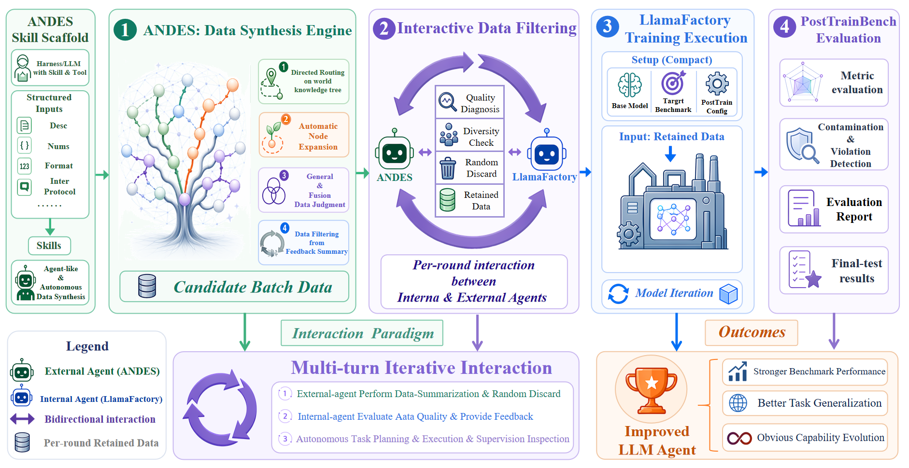

# CareRelay-AI 项目技术文档

文档版本：v1.0  
编写日期：2026-05-25  
项目路径：`C:\Users\86180\Downloads\CareRelay-AI`  
运行环境：Windows 本地开发环境，后端推荐使用 `conda` 环境 `carerelay-ai`  
服务默认地址：`http://127.0.0.1:7860`

---

## 1. 文档概述

### 1.1 项目定位

CareRelay-AI 是一个面向家庭照护交接场景的多模态智能助手。系统围绕老人、宝宝、宠物等被照护对象，将自然语言记录、语音、图片中的照护信息整理为结构化“今日交接卡”，并输出家属消息、待确认事项、下一步待办、风险雷达、时间线、语音播报、历史记录和个性化知识库。

项目当前形态是一个可运行的端到端 Demo，采用轻量级前后端架构：

- 前端：原生 `HTML + CSS + JavaScript` 单页应用。
- 后端：`FastAPI` 服务，负责静态资源、API 路由、多模态处理、模型调用、数据存储。
- 模型层：通过 OpenAI-compatible API 网关调用文本模型、视觉模型、语音识别模型、Embedding 模型和图像生成模型。
- 存储层：本地 `SQLite` 数据库保存个性化记忆和历史交接记录。
- 兜底层：模型不可用时使用本地规则、离线样例和默认图片保证 Demo 可用。

### 1.2 核心问题

真实家庭照护交接中常见问题包括：

1. 照护信息分散在口头沟通、微信群、图片、纸质单据和临时记录中。
2. 多位家属轮流照护时，“已完成、待确认、下一步”边界不清。
3. 药物、复诊、异常症状等高风险事项容易漏交接。
4. 家属消息需要清晰、简短、可执行，但手工整理成本高。
5. 不同照护对象的习惯、偏好、复诊准备规则不同，通用工具难以个性化。

CareRelay-AI 的目标是将零散信息转化为可执行的交接卡，并通过模型、规则、记忆库和安全边界共同提升交接质量。

### 1.3 文档范围

本文档覆盖以下内容：

- 工程目录与系统架构。
- 前后端实现路径。
- API 路由与数据模型。
- 多模态输入处理流程。
- Agent Pipeline 与核心算法。
- 记忆库、历史记录和去重逻辑。
- 模型调用路径与后训练模型 API 方案。
- 数据存储、部署、测试、安全和扩展方向。

---

## 2. 项目目录与工程结构

### 2.1 顶层目录

```text
CareRelay-AI/
  backend/                       后端 FastAPI 服务与 Agent Pipeline
  frontend/                      前端单页应用和静态资源
  data/                          SQLite 数据库、上传文件、缓存文件
  scripts/                       启动脚本、模型连通性测试脚本
  reference/                     项目参考文档
  README.md                      项目说明与快速启动
  report.md                      本技术文档
  requirements.txt               Python 依赖
  .env.example                   API 环境变量示例
  后训练base.png                 后训练模型 API/训练评测闭环原理图
  laoren.png                     用户生成的老人默认图源文件
```

### 2.2 后端目录

```text
backend/
  main.py             FastAPI 应用入口，定义 HTTP API 与静态资源服务
  pipeline.py         CareRelay Agent Pipeline，负责主业务编排
  api_client.py       模型 API 统一客户端
  memory.py           SQLite 记忆库与历史记录存储
  memory_policy.py    长期记忆过滤策略
  schemas.py          Pydantic 数据模型
  fallback.py         离线交接卡与 SVG 备用图
  config.py           API Key、Base URL、模型配置、数据路径配置
```

### 2.3 前端目录

```text
frontend/
  index.html                  单页应用 DOM 结构
  app.js                      前端状态管理、交互逻辑、API 调用和渲染
  styles.css                  响应式布局和视觉样式
  logocarerelay.png           产品 Logo
  assets/
    visual-elder.png          老人场景本地默认信息图
```

---

## 3. 总体架构

### 3.1 架构分层

系统采用五层架构：

| 层级 | 主要职责 | 关键文件 |
|---|---|---|
| 前端交互层 | 输入、页面状态、任务勾选、历史展示、信息图显示、视频入口 | `frontend/index.html`, `frontend/app.js`, `frontend/styles.css` |
| API 服务层 | HTTP 路由、文件上传、静态资源、模型接口封装入口 | `backend/main.py` |
| Agent 编排层 | 多模态融合、记忆检索、结构化生成、安全后处理、历史保存 | `backend/pipeline.py` |
| 模型调用层 | Chat Completion、Vision、ASR、Image、Embedding 调用 | `backend/api_client.py`, `backend/config.py` |
| 数据存储层 | SQLite 记忆、历史记录、上传文件、缓存文件 | `backend/memory.py`, `data/` |

### 3.2 系统上下文图



### 3.3 端到端业务流程



---

## 4. 运行环境与配置

### 4.1 Python 环境

推荐使用当前项目指定的 Conda 环境：

```powershell
conda activate carerelay-ai
```

当前本地服务进程已验证运行在：

```text
C:\Users\86180\anaconda3\envs\carerelay-ai\python.exe
```

### 4.2 依赖项

`requirements.txt`：

```text
fastapi
uvicorn
python-multipart
requests
numpy
pillow
```

其中：

- `fastapi` 和 `uvicorn` 用于后端 HTTP 服务。
- `python-multipart` 用于文件上传。
- `requests` 用于模型 API 请求。
- `numpy` 用于向量相似度计算。
- `pillow` 用于图片相关处理和测试脚本。

### 4.3 API 环境变量

`.env.example`：

```text
CARE_RELAY_BASE_URL=https://your-gateway.example.com/v1
CARE_RELAY_API_KEY=replace-with-your-api-key
```

实际运行时通过环境变量或 Conda 环境变量注入：

```powershell
conda env config vars set CARE_RELAY_API_KEY="your-api-key"
conda env config vars set CARE_RELAY_BASE_URL="http://123.129.219.111:3000"
conda deactivate
conda activate carerelay-ai
```

注意：技术文档和代码仓库不应包含真实 API Key。

### 4.4 启动方式

```powershell
conda activate carerelay-ai
cd C:\Users\86180\Downloads\CareRelay-AI
python -m uvicorn backend.main:app --host 0.0.0.0 --port 7860
```

或使用脚本：

```bash
bash scripts/start_demo.sh
```

---

## 5. 前端工程实现

### 5.1 页面模块

前端是一个无构建工具的单页应用，主要页面包括：

| 页面 | DOM ID | 功能 |
|---|---|---|
| 今日交接 | `todayPage` | 输入照护记录，生成交接卡，查看任务、时间线、信息图 |
| 历史 | `historyPage` | 查看历史交接记录，按日期和相似内容合并展示 |
| 知识库 | `memoryPage` | 保存和管理长期记忆 |
| 家属 | `guardianPage` | 保存主要联系人、当前照护人、交接对象、紧急联系人等设置 |
| 视频 | `videoPage` | 浏览器摄像头/麦克风观察入口 |

### 5.2 前端状态管理

`frontend/app.js` 使用一个全局 `state` 对象管理运行时状态：

```js
const state = {
  samples,
  audioBlob,
  imageFile,
  imageInsights,
  audioDecoded,
  lastCard,
  mediaRecorder,
  speechRecognition,
  progressTimer,
  careEntries,
  careEntrySeq,
};
```

核心状态说明：

- `lastCard`：最新一次生成的交接卡，用于复制、语音播报、信息图替换。
- `careEntries`：当天已固定的照护记录，支持同一天多次追加输入。
- `imageInsights`：图片解析结果。
- `audioBlob`：录音数据。
- `audioDecoded`：音频是否已经转写到文本中。

### 5.3 同日追加记录机制

真实照护中，一天会持续新增多条记录。前端实现了“固定记录 + 继续追加”的交互：

1. 用户输入一段记录。
2. 点击生成后，文本被拆分为多条 `careEntries`。
3. 输入框清空，固定记录显示在“已固定记录”区域。
4. 用户继续输入下一段内容。
5. 下一次生成时，前端把已有固定记录和新增记录合并后提交。
6. 高相似记录仅显示和提交一次。

实现路径：

```text
frontend/app.js
  analyze()
    prepareCareEntryMerge()
    careEntriesToText()
    POST /api/analyze
    commitCareEntries()
    clearComposerInput()
```

### 5.4 前端去重算法

照护记录去重由以下步骤组成：

1. 文本归一化：删除括号标签、标点、空白，统一小写。
2. bigram 切分：将中文字符串切成相邻字符二元组。
3. Dice 相似度：计算两个 bigram 集合的重叠程度。
4. 包含关系判断：短文本被长文本包含且长度比例足够时视为高相似。
5. 信号冲突保护：如果时间段、日期或数值明显不同，则不合并。

关键函数：

```text
normalizeCareRecordText()
bigrams()
careRecordSimilarity()
extractCareRecordSignals()
hasCareRecordSignalConflict()
isDuplicateCareRecord()
prepareCareEntryMerge()
```

信号冲突保护的意义：

- “早上8点爷爷吃了降压药”和“晚上8点爷爷吃了降压药”文本很像，但时间段不同，不能合并。
- “血压145/90”和“血压130/80”文本很像，但数值不同，不能合并。
- “今天复诊”和“明天复诊”文本很像，但日期不同，不能合并。

### 5.5 任务排序与完成交互

任务清单根据优先级和时间排序：

1. 高优先级优先。
2. 同优先级按时间排序。
3. 无法解析时间的任务排在后面。
4. 勾选完成后出现完成动效，并移动到当前列底部。

实现函数：

```text
priorityInfo()
parseTimelineTime()
renderTaskList()
handleTaskToggle()
reorderTaskList()
```

### 5.6 时间线排序与去重

时间线使用 `parseTimelineTime()` 解析中文时间、ISO 日期、相对日期和时间段。随后 `normalizeTimelineItems()` 按时间和事件类型排序，并对同时间同类型的近似事件保留信息量最高的一条。

排序优先级：

```text
done -> care -> confirm -> todo -> risk
```

### 5.7 历史页合并展示

历史页原始接口返回的是每次生成的记录。为了避免连续生成产生大量相似记录，前端实现历史压缩：

1. 后端取最近 48 条记录。
2. 前端按同一天、同对象、摘要相似度聚合。
3. 摘要几乎完全一致时直接合并。
4. 摘要仅相似时继续比较原始输入，避免误合并。
5. 最多展示 12 组。

实现函数：

```text
loadHistory()
historyDisplayText()
historySimilarity()
sameHistoryCluster()
compactHistoryRecords()
renderHistory()
```

### 5.8 信息图渐进显示策略

为了避免图片生成慢阻塞体验，前端采用三阶段策略：

1. 初始状态不显示默认照片，仅显示空态。
2. 文字交接卡生成完成后，立即显示本地默认图。
3. 真正 AI 图片生成成功后，再替换默认图。

老人场景默认图：

```text
frontend/assets/visual-elder.png
```

实现路径：

```text
defaultVisualAssets
imageSrc()
visualBadgeText()
renderVisual()
generateVisualAsync()
```

---

## 6. 后端 API 设计

### 6.1 API 总览

后端入口文件：`backend/main.py`

| 方法 | 路径 | 功能 |
|---|---|---|
| `GET` | `/` | 返回前端首页 |
| `GET` | `/api/health` | 健康检查 |
| `POST` | `/api/analyze` | 主分析接口，生成交接卡 |
| `POST` | `/api/transcribe` | 单独语音转写 |
| `POST` | `/api/inspect-image` | 单独图片理解 |
| `POST` | `/api/generate-visual` | 根据交接卡异步生成信息图 |
| `GET` | `/api/history` | 查询历史交接记录 |
| `GET` | `/api/samples` | 返回本地样例 |
| `GET` | `/api/offline-card` | 返回离线交接卡 |
| `POST` | `/api/memory` | 创建长期记忆 |
| `GET` | `/api/memory` | 查询长期记忆 |
| `DELETE` | `/api/memory/{memory_id}` | 删除长期记忆 |

### 6.2 主分析接口

接口：

```http
POST /api/analyze
Content-Type: multipart/form-data
```

表单字段：

| 字段 | 类型 | 说明 |
|---|---|---|
| `care_subject` | string | 照护对象，例如“爷爷”“宝宝”“小猫” |
| `user_id` | string | 用户 ID，当前 Demo 默认 `demo_user` |
| `text` | string | 合并后的照护记录文本 |
| `use_visual` | bool | 是否在主流程中生成图片。当前前端默认文字先返回，图片异步生成 |
| `audio` | file | 可选音频文件 |
| `image` | file | 可选图片文件 |

返回模型：

```python
class AnalyzeResult(BaseModel):
    ok: bool
    card: CareRelayCard
    warnings: list[str]
```

### 6.3 图片生成接口

接口：

```http
POST /api/generate-visual
Content-Type: application/json
```

请求体为 `CareRelayCard`。后端根据交接卡构造视觉 prompt，调用图像生成模型。若模型失败或返回空结果，则返回本地 SVG fallback；前端在老人场景优先保留默认图。

---

## 7. 数据模型

### 7.1 交接卡模型

核心模型定义于 `backend/schemas.py`：

```python
class CareRelayCard(BaseModel):
    care_subject: str
    date: str
    summary: str
    care_status: str
    emotion_analysis: EmotionAnalysis
    completed: list[CompletedItem]
    to_confirm: list[TodoItem]
    todos: list[TodoItem]
    long_term_watch: list[TodoItem]
    abnormal_signals: list[str]
    risk_notes: list[str]
    family_message: str
    voice_briefing: str
    interaction_questions: list[str]
    timeline: list[TimelineItem]
    risk_radar: dict[str, int]
    visual_prompt: str
    visual_image_b64: str
    visual_fallback_svg: str
    confidence: float
    memory_hits: list[MemoryHit]
    memory_suggestions: list[str]
    transcript: str
    image_insights: str
    model_trace: list[ModelCall]
    offline_mode: bool
```

### 7.2 TodoItem

```python
class TodoItem(BaseModel):
    title: str
    due_time: str
    owner: str
    priority: str
    status: str
    source: str
    safety_note: str
```

该结构用于：

- `to_confirm`：必须确认事项。
- `todos`：下一步任务。
- `long_term_watch`：长期关注策略。

### 7.3 EmotionAnalysis

```python
class EmotionAnalysis(BaseModel):
    primary_tone: str
    anxiety_level: int
    stress_points: list[str]
    reassurance: str
```

该结构用于生成情绪状态、家属沟通压力和安抚表达。

### 7.4 ModelCall

```python
class ModelCall(BaseModel):
    agent: str
    model: str
    status: str
    latency_ms: int
    detail: str
```

`model_trace` 记录每个模型调用的 Agent、模型名、状态和耗时，便于调试和验收。

---

## 8. 数据存储设计

### 8.1 SQLite 数据库

数据库路径：

```text
data/care_relay.sqlite3
```

初始化逻辑位于 `backend/memory.py` 的 `MemoryStore._init_db()`。

### 8.2 memories 表

```sql
CREATE TABLE IF NOT EXISTS memories (
  id INTEGER PRIMARY KEY AUTOINCREMENT,
  user_id TEXT NOT NULL,
  care_subject TEXT NOT NULL,
  text TEXT NOT NULL,
  label TEXT NOT NULL DEFAULT 'profile',
  embedding TEXT NOT NULL,
  active INTEGER NOT NULL DEFAULT 1,
  created_at TEXT NOT NULL,
  updated_at TEXT NOT NULL
);
```

用途：

- 存储长期照护偏好。
- 存储复诊准备规则。
- 存储对象级习惯和安全提醒。
- 提供 Embedding 检索上下文。

### 8.3 records 表

```sql
CREATE TABLE IF NOT EXISTS records (
  id INTEGER PRIMARY KEY AUTOINCREMENT,
  user_id TEXT NOT NULL,
  care_subject TEXT NOT NULL,
  input_text TEXT,
  output_json TEXT NOT NULL,
  created_at TEXT NOT NULL
);
```

用途：

- 保存每次交接输入和输出结果。
- 为历史页提供摘要和时间。
- 支持后续数据分析、评测集构造和模型后训练样本沉淀。

### 8.4 上传与缓存目录

```text
data/uploads/     用户上传的音频、图片临时文件
data/cache/       音频转码、模型测试缓存
```

运行期文件不应提交到版本库。

---

## 9. Agent Pipeline 与核心算法

### 9.1 Pipeline 主流程

核心函数：

```text
backend/pipeline.py
  CareRelayPipeline.process()
```

流程：

1. 接收文本、音频路径、图片路径、照护对象和用户 ID。
2. 若存在音频，调用 `AudioAgent` 转写。
3. 若存在图片，调用 `VisionAgent` 提取照护信息。
4. 合并文本、语音转写、图片解析结果。
5. 调用 `MemoryAgent` 检索个性化记忆。
6. 调用 `AnalysisAgent` 生成结构化 JSON。
7. 规范化输出为 `CareRelayCard`。
8. 合并本地规则解析结果，补齐任务和时间线。
9. 执行安全后处理。
10. 执行长期记忆过滤。
11. 可选生成信息图。
12. 保存历史记录。
13. 返回交接卡和 warnings。

### 9.2 多模型竞速与兜底

`_analyze()` 中采用多模型并发竞速：

```python
analysis_models = ("gpt-5.5", "gpt-5.4", "gpt-5.2", "gpt-5.4-mini", "gpt-4.1-mini")
```

策略：

- 所有分析模型并发请求。
- 高优先级模型返回合法 JSON 时立即使用。
- 低优先级模型可作为兜底。
- 如果全部失败，进入本地结构化规则 fallback。

优点：

- 降低单一模型超时风险。
- 兼顾高质量和响应速度。
- 保证 Demo 可用性。

### 9.3 JSON 抽取与结构化归一

模型输出可能包含 Markdown、解释文本或 `<think>` 片段。`_extract_json_object()` 做如下处理：

1. 去掉 Markdown 代码块。
2. 去掉 `<think>...</think>`。
3. 从第一个 `{` 开始扫描。
4. 按括号深度找到完整 JSON 对象。
5. 使用 `json.loads()` 解析。

随后 `_normalize_card()` 将模型输出归一为 `CareRelayCard`：

- 字符串和列表统一。
- 风险雷达归一为 0 到 100。
- 情绪焦虑值归一为 0 到 100。
- Todo 字段补齐 `title`、`owner`、`priority`、`status`。
- 缺失时间线时从完成项、待确认项和待办项生成。

### 9.4 本地规则解析算法

当模型失败或字段不完整时，系统使用本地规则解析输入。

关键函数：

```text
_parse_input_text()
_split_input_sentences()
_clean_input_title()
_infer_due_time()
```

主要正则类别：

| 类别 | 例子 | 作用 |
|---|---|---|
| 已完成 | 已经、已、吃了、喝了、测了、完成 | 归入 `completed` |
| 待确认 | 没确认、未确认、是否、有没有、需要确认 | 归入 `to_confirm` |
| 待办 | 下一步、需要、准备、观察、复查、明天 | 归入 `todos` |
| 药物风险 | 药、服用、剂量、处方、mg、ml | 提升优先级并加入安全提醒 |
| 异常风险 | 血压、血糖、发烧、呕吐、疼痛、精神差 | 提升优先级并加入观察提醒 |

### 9.5 记忆检索算法

记忆检索位于 `backend/memory.py`：

1. 查询当前 `user_id + care_subject` 下的 active 记忆。
2. 调用 Embedding 模型生成 query 向量。
3. 从 SQLite 读取记忆向量。
4. 使用余弦相似度排序。
5. 返回 Top-K 记忆。

余弦相似度：

```text
score = dot(query_embedding, memory_embedding) /
        (norm(query_embedding) * norm(memory_embedding))
```

当远程 Embedding 不可用时，`APIClient.local_embedding()` 使用字符级 Hash Embedding 作为 fallback。

### 9.6 长期记忆过滤策略

长期记忆过滤位于 `backend/memory_policy.py`。

目标：防止把“今天/今晚/明天”的一次性待办保存为长期记忆。

规则：

- 短期标记：今天、今晚、明天、下次、刚刚、尽快、具体日期等。
- 一次性标记：待确认、还没、发到家人群、已完成等。
- 长期标记：每次、每天、固定、通常、习惯、偏好、复诊前、睡前等。
- 只有具备长期价值且非一次性任务的内容才进入 `memory_suggestions`。

### 9.7 安全后处理算法

`_apply_safety()` 对模型结果进行保守后处理：

- 如果摘要、家属消息或任务中出现药物相关词，但风险备注缺少“按医嘱/医生”，则追加安全提醒。
- 替换不安全措辞，例如“保证不会漏”“不用去医院”“一定没事”“再吃一次”。
- 药物相关待办如果缺少 `safety_note`，自动补充“按医嘱执行；不确定时先联系家人或医生确认。”

### 9.8 健康指数计算

前端 `healthIndex()` 根据风险雷达和待确认事项计算展示分：

```text
riskAverage = mean(risk_radar values)
pendingPenalty = min(18, to_confirm.length * 3)
score = clamp(100 - riskAverage * 0.48 - pendingPenalty, 35, 98)
```

该分数不是医学指标，而是交接完整度和风险压力的展示指数。

---

## 10. 模型调用与系统实现路径

### 10.1 模型客户端

模型调用统一封装在：

```text
backend/api_client.py
```

初始化：

```python
client = APIClient()
client.base_url = CONFIG.base_url
client.api_key = CONFIG.api_key
client.models = CONFIG.models
```

所有请求通过 `requests.Session()` 发送，并设置：

```python
self.session.trust_env = False
```

这样可以避免本地代理环境变量影响模型网关请求。

### 10.2 API 路径

当前模型 API 使用 OpenAI-compatible 路径：

| 能力 | HTTP 路径 | 实现函数 |
|---|---|---|
| 文本分析 | `{base_url}/chat/completions` | `chat_completion()` |
| 图片理解 | `{base_url}/chat/completions`，携带 `image_url` | `analyze_image()` |
| 语音转写 | `{base_url}/audio/transcriptions` | `transcribe_audio()` |
| 图像生成 | `{base_url}/images/generations` | `generate_image()` |
| 向量生成 | `{base_url}/embeddings` | `embed()` |

### 10.3 模型配置

位于 `backend/config.py`：

```python
class ModelConfig:
    analysis_models = ("gpt-5.5", "gpt-5.4", "gpt-5.2", "gpt-5.4-mini", "gpt-4.1-mini")
    vision_models = ("qwen3-vl-32b-instruct", "qwen3-vl-8b-Instruct", "gpt-4o-mini")
    asr_model = "whisper-1"
    image_model = "gpt-image-2"
    embedding_model = "text-embedding-3-large"
```

如果后训练模型已经部署在同一个 API 网关下，可以将后训练模型名加入或替换 `analysis_models`，例如：

```python
analysis_models = ("care-relay-posttrain-base", "gpt-5.4-mini", "gpt-4.1-mini")
```

如果后训练模型通过网关别名暴露，也可以保持代码不变，只在网关层将某个模型名路由到后训练模型。

### 10.4 主生成调用路径

```text
用户点击“生成今日交接卡”
  -> frontend/app.js analyze()
  -> POST /api/analyze
  -> backend/main.py analyze()
  -> CareRelayPipeline.process()
  -> APIClient.transcribe_audio()     可选
  -> APIClient.analyze_image()        可选
  -> MemoryStore.search()
  -> APIClient.chat_completion()
  -> CareRelayPipeline._normalize_card()
  -> CareRelayPipeline._apply_safety()
  -> MemoryStore.save_record()
  -> 返回 AnalyzeResult
  -> frontend/app.js renderResult()
```

### 10.5 图片生成调用路径

```text
文字交接卡返回
  -> frontend/app.js renderVisual()
  -> 先显示本地默认图
  -> generateVisualAsync()
  -> POST /api/generate-visual
  -> backend/main.py generate_visual()
  -> CareRelayPipeline._build_visual_prompt()
  -> APIClient.generate_image()
  -> 返回 visual_image_b64
  -> 前端替换默认图
```

---

## 11. 后训练模型 API 与原理图说明

后训练模型 API 原理图文件：

```text
C:\Users\86180\Downloads\CareRelay-AI\后训练base.png
```

文档引用：



### 11.1 后训练链路概览

该原理图展示了一个面向领域模型优化的闭环系统，核心分为四个阶段：

1. `ANDES: Data Synthesis Engine`
2. `Interactive Data Filtering`
3. `LlamaFactory Training Execution`
4. `PostTrainBench Evaluation`

最终目标是得到一个能力增强的 LLM Agent，在目标 Benchmark 上具备更强性能、更好泛化能力和更明显的能力演化。

### 11.2 ANDES 数据合成引擎

图中左侧是 `ANDES Skill Scaffold`，输入包括：

- `Desc`：任务描述。
- `Nums`：样本数量。
- `Format`：输出格式。
- `Inter Protocol`：交互协议。
- 其他结构化输入。

ANDES 使用外部 Agent 进行自动数据合成，形成 `Candidate Batch Data`。合成过程包含：

1. 基于世界知识树的定向路由。
2. 自动节点扩展。
3. 通用融合与数据判断。
4. 来自过滤器的反馈摘要。

映射到 CareRelay-AI：

- 输入可以是照护对象类型、家庭场景、药物/复诊/异常事件、家属沟通格式。
- 输出可以是结构化交接样本，包括原始输入、期望 `CareRelayCard` JSON、安全提醒和家属消息。
- 数据合成可覆盖老人、宝宝、宠物三类主场景。

### 11.3 交互式数据过滤

图中第二阶段是 `Interactive Data Filtering`，由外部 ANDES Agent 和内部 LlamaFactory Agent 进行多轮交互。

过滤项包括：

- `Quality Diagnosis`：质量诊断。
- `Diversity Check`：多样性检查。
- `Random Discard`：随机丢弃，避免过拟合模板。
- `Retained Data`：保留数据。

映射到 CareRelay-AI：

- 检查交接卡 JSON 是否符合 `CareRelayCard` schema。
- 检查样本是否覆盖不同对象、不同时间、不同风险类型。
- 去除重复、高相似、过短、过度模板化样本。
- 保留能提升事件抽取、任务拆解、安全表达的样本。

### 11.4 LlamaFactory 训练执行

图中第三阶段是 `LlamaFactory Training Execution`。输入包括：

- `Base Model`
- `Target Benchmark`
- `PostTrain Config`
- `Retained Data`

输出是迭代后的模型。

在 CareRelay-AI 中，后训练模型建议聚焦以下任务：

| 任务 | 目标 |
|---|---|
| 事件抽取 | 从自然语言中抽取时间、动作、对象、状态 |
| 状态分类 | 区分已完成、待确认、下一步、长期记忆 |
| 安全表达 | 药物、剂量、症状场景使用保守表达 |
| JSON 结构化 | 稳定输出 `CareRelayCard` |
| 家属消息生成 | 生成可直接转发的短消息 |
| 风险识别 | 识别药物、复诊、异常、沟通四类风险 |

### 11.5 PostTrainBench 评测

图中第四阶段是 `PostTrainBench Evaluation`，包含：

- 指标评测。
- 污染与违规检测。
- 评测报告。
- 最终测试结果。

建议 CareRelay-AI 的评测指标如下：

| 指标 | 说明 |
|---|---|
| Schema Validity | 输出 JSON 能否被 `CareRelayCard` 解析 |
| Event Recall | 已完成、待确认、待办事项召回率 |
| Time Accuracy | 时间点与相对时间解析准确率 |
| Safety Compliance | 是否避免诊断、剂量建议和不安全承诺 |
| Family Readability | 家属消息是否简洁可执行 |
| Memory Precision | 长期记忆建议是否非一次性事项 |
| Risk Coverage | 药物、复诊、异常、沟通风险覆盖率 |
| Hallucination Rate | 是否编造输入中不存在的事实 |

### 11.6 后训练模型 API 接入方式

后训练模型最终应通过与现有网关兼容的 Chat Completion API 暴露：

```http
POST {CARE_RELAY_BASE_URL}/chat/completions
Authorization: Bearer {CARE_RELAY_API_KEY}
Content-Type: application/json
```

请求示例：

```json
{
  "model": "care-relay-posttrain-base",
  "messages": [
    {"role": "system", "content": "你是 CareRelay AI 家庭照护交接 Agent..."},
    {"role": "user", "content": "对象: 爷爷\n输入记录: 今天早上8点吃了降压药..."}
  ],
  "temperature": 0.1,
  "max_tokens": 1600,
  "response_format": {"type": "json_object"}
}
```

接入代码位置：

```text
backend/config.py
  ModelConfig.analysis_models

backend/api_client.py
  APIClient.chat_completion()

backend/pipeline.py
  CareRelayPipeline._analyze()
```

如果需要灰度发布，可以将后训练模型放在第一优先级，原通用模型作为 fallback：

```python
analysis_models = (
    "care-relay-posttrain-base",
    "gpt-5.4",
    "gpt-5.4-mini",
    "gpt-4.1-mini",
)
```

---

## 12. 数据来源与数据治理

### 12.1 当前运行数据

当前 Demo 使用的数据包括：

- 用户输入的文本照护记录。
- 浏览器录音或上传音频。
- 上传的图片。
- 模型生成的结构化交接卡。
- 本地长期记忆。
- 历史交接记录。
- 默认样例数据。

### 12.2 样例数据

样例数据位于：

```text
frontend/app.js
backend/fallback.py
```

覆盖场景：

- 老人：降压药、血压偏高、晚间用药待确认、明日复诊。
- 宝宝：喝奶、睡眠、哭闹、洗澡、胀气观察。
- 宠物：喂食、呕吐、喂药、宠物医院复查。

### 12.3 后训练数据构造建议

建议将运行数据转化为后训练数据时采用如下格式：

```json
{
  "instruction": "将家庭照护记录整理为 CareRelayCard JSON。",
  "input": {
    "care_subject": "爷爷",
    "text": "今天早上8点给爷爷吃了降压药，中午吃了一碗粥...",
    "memory_hits": [
      "爷爷复诊前通常需要准备医保卡、病历本、最近三天血压记录。"
    ]
  },
  "output": {
    "summary": "...",
    "completed": [...],
    "to_confirm": [...],
    "todos": [...],
    "risk_notes": [...]
  }
}
```

### 12.4 隐私与脱敏

家庭照护数据可能包含姓名、电话、地址、病历、药物、图片和语音。用于后训练或评测前应进行：

- 姓名脱敏。
- 电话脱敏。
- 地址脱敏。
- 病历号和身份证号脱敏。
- 图片 OCR 文本脱敏。
- 音频转写文本脱敏。
- 删除无关聊天内容。

---

## 13. 安全边界与合规策略

CareRelay-AI 的安全定位是“家庭照护交接辅助”，不是医疗诊断工具。

### 13.1 明确禁止

系统不应：

- 给出诊断结论。
- 建议用户自行调整药物剂量。
- 承诺“一定没事”。
- 在药物状态不确定时建议重复服药。
- 替代医生、护士或药师的专业判断。

### 13.2 安全表达模板

系统在高风险场景使用保守表达：

- “涉及药物、剂量或复诊安排时，请按医嘱执行。”
- “不确定时先联系医生或家人确认。”
- “未确认前不要重复给药。”
- “若异常持续或加重，请及时联系专业人员。”

### 13.3 技术实现

安全约束分三层：

1. Prompt 约束：系统提示中声明禁止诊断和剂量建议。
2. Schema 约束：不确定事项进入 `to_confirm`，不直接作为已完成。
3. 后处理约束：`_apply_safety()` 替换不安全措辞并补充安全提醒。

---

## 14. 工程可靠性设计

### 14.1 超时控制

模型配置包含独立超时：

```python
chat_timeout = 14
vision_timeout = 45
image_timeout = 130
asr_timeout = 24
```

图片生成耗时长，因此前端将其拆成异步流程：

- 文字先返回。
- 默认图先显示。
- 真图后台替换。

### 14.2 Fallback 策略

| 故障 | Fallback |
|---|---|
| 文本模型超时或 JSON 不合法 | 本地规则结构化解析 |
| Vision 模型失败 | 忽略图片，继续处理文本和语音 |
| ASR 失败 | 保留文本输入，提示转写失败 |
| 图像生成失败 | SVG 备用图或本地默认图 |
| Embedding 失败 | 本地 Hash Embedding |
| 主流程异常 | 离线交接卡 |

### 14.3 可观测性

每次模型调用会记录 `ModelCall`：

- Agent 名称。
- 模型名称。
- 调用状态。
- 延迟毫秒数。
- 错误或返回细节。

这些信息写入 `CareRelayCard.model_trace`，可用于调试、演示验收和后续监控。

---

## 15. 测试与验收

### 15.1 语法检查

前端 JavaScript：

```powershell
node --check frontend\app.js
```

### 15.2 模型连通性测试

脚本：

```powershell
conda activate carerelay-ai
python scripts\smoke_models.py
```

测试内容：

- 文本模型是否可返回 JSON。
- 视觉模型是否能解析图片。
- ASR 是否能处理音频。
- 图像生成模型是否返回图片。
- Embedding 模型是否返回向量。

### 15.3 功能验收用例

| 用例 | 输入 | 预期 |
|---|---|---|
| 老人交接 | 早上吃药、中午进食、晚上待确认、明天复诊 | 输出已完成、待确认、下一步、风险提醒 |
| 同日追加 | 第一次输入早上记录，第二次输入晚上记录 | 固定记录累计，第二次生成不覆盖第一次 |
| 重复记录 | 重复输入“晚饭吃了半碗面” | 只显示一次，提示已合并 |
| 时间冲突 | 早上8点吃药、晚上8点吃药 | 不误合并 |
| 图片解析 | 上传处方或药盒 | 图片要点写入记录 |
| 语音转写 | 录音口述照护记录 | 转写文本进入输入框 |
| 历史合并 | 多次生成相似卡片 | 历史页按组展示并显示合并数量 |
| 信息图 | 文字生成完成后 | 先显示默认图，真图完成后替换 |
| 家属设置 | 修改主要联系人并保存 | 右侧摘要同步，刷新后保留 |

---

## 16. 部署与交付建议

### 16.1 本地部署

```powershell
conda activate carerelay-ai
cd C:\Users\86180\Downloads\CareRelay-AI
python -m uvicorn backend.main:app --host 0.0.0.0 --port 7860
```

浏览器访问：

```text
http://127.0.0.1:7860
```

### 16.2 生产化建议

若进入生产环境，建议：

- 使用反向代理，例如 Nginx。
- API Key 放入密钥管理系统。
- SQLite 替换为 PostgreSQL。
- 上传文件进入对象存储。
- 增加用户鉴权和家庭空间权限。
- 增加模型调用日志、错误率、延迟和成本监控。
- 增加数据脱敏和删除策略。
- 对医疗相关高风险输出做更严格审核。

---

## 17. 当前限制

1. 当前用户体系为 Demo 级，默认 `demo_user`，未实现多用户鉴权。
2. 长期记忆使用 SQLite 存储，适合本地演示，不适合多人高并发生产。
3. 知识图谱目前主要体现在设计和规则推理层，尚未接入独立图数据库。
4. 图像生成依赖外部模型，延迟较高，因此前端采用默认图过渡。
5. 当前家属设置保存在浏览器 `localStorage`，跨设备不同步。
6. 后训练模型 API 接入点已经预留，但具体模型名称需要由部署网关提供。

---

## 18. 后续技术路线

### 18.1 后训练模型落地

短期建议：

- 构建 500 到 2000 条老人、宝宝、宠物交接样本。
- 严格标注 `CareRelayCard` JSON。
- 使用 ANDES 生成边界样本和异常样本。
- 使用 LlamaFactory 执行 SFT。
- 用 PostTrainBench 评估 Schema、风险、安全和泛化。

中期建议：

- 将后训练模型配置为 `analysis_models` 第一优先级。
- 原通用模型作为 fallback。
- 将模型输出质量和失败样本回流到 ANDES 数据合成和过滤环节。

### 18.2 知识图谱落地

可将当前隐式规则升级为图谱：

```text
CareSubject -> Event -> Time -> Status -> Risk -> GuardianAction
```

推荐技术栈：

- 轻量阶段：SQLite JSON 字段或 NetworkX。
- 中期阶段：Neo4j 或 TuGraph。
- 推理方式：实体抽取 + 图检索 + Prompt 注入。

### 18.3 多端协同

后续可接入：

- 微信/短信推送。
- 日历提醒。
- 家庭摄像头。
- IoT 设备数据，例如血压计、体温计、喂食器。
- 多成员协作权限。

---

## 19. 总结

CareRelay-AI 当前已经形成从多模态输入到结构化交接输出的完整闭环：

```text
文本/语音/图片
  -> 多模态融合
  -> 个性化记忆检索
  -> 后训练/通用模型结构化分析
  -> 本地规则补齐
  -> 安全边界后处理
  -> 今日交接卡
  -> 历史记录、信息图、家属消息、语音播报
```

系统的工程特点是轻量、可复现、可演示，同时具备继续产品化的扩展基础。其关键技术价值在于：

- 使用 Agent Pipeline 将多模型能力拆分成可维护模块。
- 使用结构化 Schema 保证前端稳定渲染。
- 使用记忆库和去重机制支持真实同日连续照护场景。
- 使用安全后处理降低医疗相关风险。
- 使用后训练链路为领域模型专项优化预留了明确接口。

该项目不仅是一个聊天式大模型 Demo，而是一个具备工程闭环、数据闭环和模型迭代路径的家庭照护交接系统原型。
